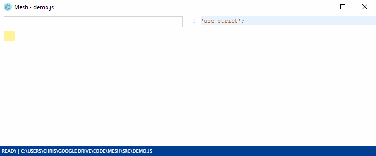

# Mesh Spreadsheet

Mesh is a JavaScript code editor that feels like a spreadsheet.

Specifically, Mesh is a spreadsheet UI wrapper around a text file editor. Actions on the grid are automatically translated to changes in the JavaScript code.

Mesh's aim is to improve the user experience of 'regular' programming languages. Consider Mesh if you:

- use JavaScript, but want rapid visual feedback and a convenient grid UI
- use spreadsheets, but feel constrained by Excel's limitations.

**WARNING!** Mesh is under active development. The UI and APIs will likely change a lot, it is not well optimised, and there are lots of missing features and bugs. Follow updates at [@MeshSpreadsheet](https://twitter.com/MeshSpreadsheet).

## How to get Mesh

You can [try Mesh online](http://mesh-spreadsheet.com/try-mesh.html). You'll get best results in a recent version of Google Chrome. Note the web demo doesn't have file reading or writing right now.

To work with local files (read and write), you will need to build the source and run with Electron:

1. Install [Yarn](https://yarnpkg.com/en/docs/install) or the **latest** LTS version of [node.js](https://nodejs.org/en/download/)
2. Clone the Mesh source via Git
3. In the Mesh `src` directory, at the command line, type `yarn` or `npm install` (as relevant) and press Enter.
4. In the Mesh `src` directory, at the command line, type `yarn build_electron` or `npm build_electron` (as relevant) and press Enter.

Then to launch, again in the `src` directory, type `yarn start` or `npm start` (as relevant) and press Enter.

Repeat step 4 for every code change.

## Quick user guide

Mesh is a JavaScript code editor. Your actions in the 2D grid on the left change the code text on the right. The code on the right is run (`eval`ed) every time you commit a change from the formula bar (by pressing `Enter` or `Tab`), or from the code pane (by clicking back on the grid).

When you select a cell, the corresponding code will be selected in the right-hand pane.

### Name-based referencing

Compared to existing spreadsheet programs, Mesh does not have location-based referencing - every value has a name.

Create a name by typing a name into a cell. You'll see this inserts some `Mesh.attach` code in the right-hand pane.

Assign a value to a name by typing into the cell to the right of a name (for example `123` or `"Hello world!"` or `true`). Note strings need to be in single or double quotes, or backticks for template literals.

Replace the contents of a cell by selecting it and writing over it. Edit a cell's contents by pressing `F2`. Commit the edit by pressing `Enter`. Note that if the cell is the result of a calculation (such as a processed array), you'll edit the formula that produced the cell, not the calculated value in the cell.

### Arrays and objects

Create an array or object by typing `[]` or `{}` into a value box.

Items in arrays and objects take up their own cells and can be individually manipulated:

- Append to an array or object by typing into the 'append' cells that appear
- Insert a new cell above a selected cell with `Ctrl =`
- Delete a selected cell with `Ctrl -`.

Delete the array or object entirely with `Ctrl _` (ie `Ctrl Shift -`).

### Other data structures

Mesh has built-in support for displaying JavaScript primitives, arrays and objects, but sometimes you'll want to customise how the code and its results map to the grid, including the actions that occur when you select a cell or commit a change.

You can give a custom display function to `Mesh.attach`. This is how we show records (arrays of objects) as a table.

### Functions and other edits

You can also edit the code directly by clicking and typing into the code pane. Commit the change by clicking back onto the grid. This is useful for editing code that makes less sense to interact with via a grid or formula bar, such as large functions.

### Meta

Open a file with `Ctrl o`, save with `Ctrl s`, save as with `Ctrl S` (ie `Ctrl Shift s`).

Show and hide the code pane with `Ctrl U` (ie `Ctrl Shift u`).

If Mesh breaks, reload with `F5`.

## Benefits of Mesh (or "LOL, you will never beat Excel")

Mesh is *not* intended to replace existing spreadsheet programs in all domains.

Existing spreadsheet programs offer location-based referencing and formatting, which is very flexible. This makes them perfect as a calculation scratch-pad, or for viewing or editing data in formats like CSVs.

However, spreadsheets are often used in domains where a 'traditional' programming languages would be a better tool, such as repeated processes with minimal human intervention. In particular, spreadsheets are poor at processing and generating data of arbitrary length ([more discussion here](http://chrispsn.com/mesh-preview.html)).

In these cases, a spreadsheet is often used because of the user's familiarity or preference for a spreadsheet environment, or because a spreadsheet is the only tool available in the user's position (perhaps it's pre-installed on colleagues' machines, or the user does not have permission to install new programs or use cloud solutions).

For writing programs, Mesh has advantages over a 'traditional' spreadsheet:

- Mesh is designed to process, and generate, data of arbitrary length
- the absence of location-based referencing eliminates a class of errors that normally require humans to identify and fix
- the Mesh file format is just JavaScript code in a text file, so:
  - `diff`ing is easy (function is built into Windows: [`FC`](https://ss64.com/nt/fc.html) in CMD, [`Compare-Object`](https://serverfault.com/a/5604) in PowerShell)
  - it integrates with standard version control systems like Git
  - you don't need Mesh to run a Mesh file, so you can integrate Mesh files into other systems.

Also, Mesh is written in JavaScript so, in theory, most people have a way of getting and running it. This and its familiar interface give it a better shot of overcoming 'spreadsheet inertia', particularly if we can get it running on Windows without installation being required (via JScript).

## Caveats with this approach

- Unlike Excel, the whole file gets recalculated every time (no caching of values that won't change)
- Mesh misses out on Excel's built-in functions (although if we can get Mesh running on native Windows via JScript, we can probably get access to `WorksheetFunction` via COM).

## Known issues

- Incomplete syntax support (eg spreads (`[...elements, "extra"]`); Maps and Sets; some functions)
- Can't rename a name without it breaking other references in the file (Excel beats this hands down)
- When editing in the formula bar, it should show the edits in the cell 'live', highlight input cells in the grid, and let you click on a cell to insert a reference
- Poor compatibility with standard data formats like CSV (I need to figure out how to integrate a CSV parser without compromising the ability to run Mesh files without Mesh)
- Poor integration with Electron (such as menu items for New, Open, Save, Save As)

## I want to contribute!

Awesome! Please check out the [contributions guide](CONTRIBUTING.md). The codebase is pretty rough right now, so feel free to get in touch via Twitter too.

## Bugs, issues, enhancements, contact

Please file any bugs, issues or enhancements via GitHub.

Contact me at Twitter: [@MeshSpreadsheet](https://twitter.com/MeshSpreadsheet).
