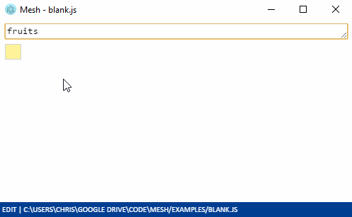

# Mesh

Mesh is a JavaScript IDE that feels like a spreadsheet.

Visualise and edit JavaScript data structures (arrays, objects, etc) in the same way you'd work with named ranges and tables in Excel.

Consider Mesh if you:

- use traditional programming languages, but want to 'see' the results and get more rapid feedback, or express your code in a 2D grid
- use spreadsheets, but feel constrained by Excel's limitations.

**WARNING!** Mesh is under active development. It will likely change a lot. It is not well optimised from a speed or UI standpoint.

## How to get Mesh

### Default

TODO

### From source

1. Install [Yarn](https://yarnpkg.com/en/docs/install) or the LTS version of [node.js](https://nodejs.org/en/download/)
2. [Download the Mesh source](https://github.com/chrispsn/mesh/archive/master.zip)
3. In the Mesh `src` directory, at the command line, type `yarn` or `npm install` (as relevant) and press Enter.

Then to launch, again in the `src` directory, type `yarn start` or `npm start` (as relevant) and press Enter.

## Quick user guide

Mesh is a JavaScript code editor. Your actions in the 2D grid on the left change the code text on the right. The code on the right is run (`eval`ed) every time it changes.

When you select a cell, the corresponding code will be selected in the right-hand pane.

Create a name by typing a name into a cell. You'll see this inserts some `Mesh.attach` code in the right-hand pane.

Assign a value to a name by typing into the cell to the right of a name (for example `123` or `"Hello world!"` or `true`). Note strings need to be in single or double quotes, or backticks.

Replace the contents of a cell by selecting it and writing over it. Edit a cell's contents by pressing `F2`. Commit the edit by pressing `Enter`. Note that if the cell is the result of a calculation (such as a processed array), you'll edit the formula that produced the cell, not the calculated value in the cell.

### Arrays and objects

Create an array or object by typing `[]` or `{}` into a value box.

Unlike regular values, constituents of array and object cells can be individually manipulated:

- Append to an array or object by typing into the 'append' cells that appear
- Insert a new element above a selected cell with `Ctrl =`
- Delete a selected element with `Ctrl -`

Delete the array or object entirely with `Ctrl _` (ie `Ctrl Shift -`).

### Other data structures

Mesh has built-in support for displaying JavaScript primitives, arrays and objects, but sometimes you'll want to customise how the code and its calculation results map to the grid.

You can give a custom display function as an argument to `Mesh.attach`. This is how we show records (arrays of objects) as a table.

### Functions and other edits

You can also edit the code directly by clicking and typing into the code pane. This is useful for editing code that makes less sense to interact with via a grid or formula bar, such as large functions.

### Meta

Open a file with `Ctrl o`, save with `Ctrl s`, save as with `Ctrl S` (ie `Ctrl Shift s`).

## Benefits of Mesh

Excel's automatic calculations and location-based referencing model provide fast feedback and a low learning curve.

However, if you want to work with data of arbitrary size within an Excel spreadsheet, you need to go outside 'automatic' calculations (eg VBA, Pivot Table refreshing, etc). At best, this breaks the user's workflow; at worst, this is an avoidable source of human error.

In Mesh, everything is a named range or formula. In fact, Mesh is just a spreadsheet UI wrapper around a text file editor; actions on the spreadsheet are automatically translated to changes in the JavaScript code.

[More discussion here](http://chrispsn.com/mesh-preview.html).

### LOL you will never beat Microsoft Excel at its own game

Excel's location-based referencing model and formatting make it perfect as a calculation scratch-pad, or for viewing or editing data in formats like CSVs.

Also, Google Sheets solves some of Excel's problems; for example, it can display data of arbitrary length, with some caveats.

I think Mesh has some advantages over both Excel and Google Sheets as a tool for developing applications, or infrastructure, or repeated processes. Aside from the 'data of arbitary length' point above:

- the file format is just JavaScript code in a text file, so:
  - `diff`ing is easy (function is built into Windows: `FC` in CMD, [`Compare-Object`](https://serverfault.com/a/5604) in PowerShell)
  - it integrates with standard version control systems like Git
  - you don't need Mesh to run a Mesh file
- JavaScript is under active development and the community is huge
- Mesh is written in JavaScript so, in theory, most people have a way of getting and running it. This gives it a good shot of minimising the frictions associated with getting new software.

[More discussion, with examples](http://chrispsn.com/mesh-preview.html).

## Caveats with this approach

- Unlike Excel, the whole file gets recalculated every time (no caching of values that won't change)
- Won't work well with names whose values change over the course of a file (you may get best results if you adopt an 'immutability' convention)
- Miss out on Excel's built-in functions (although if we can get Mesh running on native Windows via JScript, we can probably get access to `WorksheetFunction` via COM).

## Known issues

- Can't rename a name without it breaking other references in the file (Excel beats this hands down)
- Grid experience could be better; eg when in EDIT mode, highlighting inputs in the grid or clicking on the sheet to insert a reference
- Poor compatibility with standard data formats like CSV (I am not sure how to integrate a CSV parser without compromising the ability to run Mesh files without Mesh)
- Incomplete coverage of built-in data structures, such as Maps or Sets
- Poor integration with Electron (eg menu items)
- Poor user experience with `Mesh.attach` (function signature and code insertion).

## Possible enhancements

- Allow the user to add buttons so they can run functions in the file outside the 'automatic' calculation loop (such as exporting the result of a calculation)
- Windows-native JScript version (so if people can get the JS files onto their machine, they can run Mesh locally)
- Cloud version
- Custom themes
- Optionally use TypeScript or ClojureScript as formula languages.

## Bugs, issues, enhancements, contact

Please file any bugs, issues or enhancements via GitHub.

To contact me: chrispsn+mesh AT gmail.