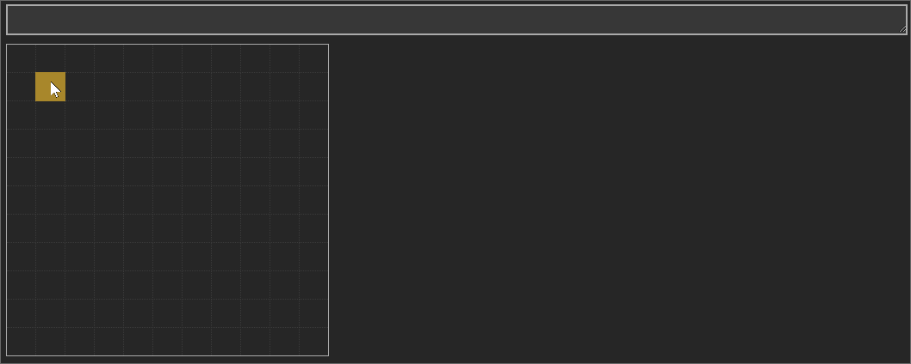

# Mesh Spreadsheet

Mesh is a JavaScript code editor that feels like a spreadsheet.

Specifically, Mesh is a spreadsheet UI wrapper around a text file editor. Actions on the grid are automatically translated to changes in the JavaScript code.

Mesh's aim is to help people maximise their personal productivity. Consider Mesh if you:

- use JavaScript, but want rapid visual feedback and a convenient grid UI
- use spreadsheets, but feel constrained by Excel's limitations.

**WARNING!** Mesh is under active development. The UI and APIs will likely change a lot, it is not well optimised, and there are lots of missing features and bugs. Follow updates at [@MeshSpreadsheet](https://twitter.com/MeshSpreadsheet).

## How to get Mesh

You can [try Mesh online](http://mesh-spreadsheet.com/try-mesh.html). It'll run faster in new browsers but it works all the way down to Internet Explorer 11.

You can also [download the project as a zip file](https://github.com/chrispsn/mesh/archive/master.zip) and double-click on `try-mesh.html` in the `src` directory.

Note that Mesh doesn't have file reading or writing right now; we have plans to add it via [Monotreme](https://github.com/chrispsn/monotreme).

## Quick user guide

Mesh is a JavaScript code editor. Your actions in the 2D grid on the left change the code text on the right. The code on the right is run every time you commit a change from the formula bar (by pressing `Enter` or `Tab`).

You can see the generated code by toggling the code pane. There is a button in the status bar at the bottom. You can also edit the code directly and then click on the grid to run it.

### Name-based referencing

Compared to existing spreadsheet programs, Mesh does not have location-based referencing - every value has a name.

Create a name by typing a name into a cell.

Assign a value to a name by typing into the cell to the right of a name, for example:

- Numbers: `123`
- Strings: `Hello world!`
- Booleans: `true`
- Functions: `function() {return 1 + 2}`
- Dates: `2018-11-10`.

To make data entry easier, we rewrite your "common sense" input to a JavaScript equivalent (like other spreadsheet programs). For example, `Hello world!` (without quotes) will be written into `"Hello world!"` (with quotes).

Add a formula to a cell in the same way:

- `=1+2`
- `=some_cell_name + 123`.

Effectively formulas are a way to write "raw" JavaScript code, including code that references other cells.

Replace the contents of a cell by selecting it and writing over it. Edit a cell's contents by pressing `F2`. Commit the edit by pressing `Enter`.

### Tables

Tables are common in spreadsheets, but less so in traditional programming languages. Mesh hopes to change that!

Tables appear in the grid as rows and columns with a header row at the top.

But in JavaScript terms, tables are arrays of objects. The wrapper function `_makeTable` adds the ability to:

- specify default columns (default row object properties), including calculated columns (parameter 1)
- expand or shrink based on a specified length, including one calculated from other cells at runtime (parameter 2)
- reference other cells in the table based on the row's absolute or relative position, via a few default row properties:
  - `this` (the row)
  - `i` (the row's index)
  - `t` (the table).

Create an array or object by clicking on an empty cell or value cell and pressing `Ctrl + Alt + t`.

You can then add or delete columns or rows:

- Append to an array or object by typing into the 'new row' cells that appear
- Insert a new cell above a selected cell with `Ctrl =`
- Delete a selected cell with `Ctrl -`.

Delete the array or object entirely with `Ctrl _` (ie `Ctrl Shift -`).

Search a table for a row with the built-in `find` function, or query it with standard array methods like `map`, `filter` and `reduce`.

Use tables to simplify heavily nested (indented) code, such as complex conditional logic or multi-dimensional concepts. Peter Kankowski's Code Project article [Table-driven approach](https://www.codeproject.com/Articles/42732/Table-driven-Approach) has some great examples.

### Mesh files

Mesh files are just plain-text JavaScript files. To see the contents of the file you're writing, toggle the **code pane** with the link in the status bar at the bottom of the screen.

You can edit the spreadsheet and see the change in the code on the right.

You'll also see some **boilerplate code** near the bottom. The boilerplate:

- turns the cells specification in `_CELLS` into a functioning spreadsheet, with caching of cell values whose inputs have not changed
- provides table creation (with their own internal caching) and the `find` function to query tables alongside standard ES5 JavaScript array methods
- uses a function `sc` to strip out parts of cells that won't make it through the [structured clone algorithm](https://developer.mozilla.org/en-US/docs/Web/API/Web_Workers_API/Structured_clone_algorithm) when the spreadsheet output is sent through [nb: this may be moved out of the boilerplate]

We're also considering adding:
- a ES5-friendly way to [write functions in shorter syntax](https://gist.github.com/chrispsn/4d451e0ebe5600148c7c392f6281b251)
- some standard 'data aggregation' functions like `SUM`.

The boilerplate will be updated from time to time; for this reason, it has a version date in the comments.

### Messaging

Mesh sheets are JavaScript apps in their own right, and with a little extra boilerplate, they can send and receive messages.

In particular, you can send in streams of values and get calculations out:

We're looking into the best way to allow Mesh sheets to support a wide variety of message formats. Right now the Mesh app uses cross-document messaging via [`onmessage`](https://developer.mozilla.org/en-US/docs/Web/API/EventSource/onmessage) and [`postMessage`](https://developer.mozilla.org/en-US/docs/Web/API/Window/postMessage).

We're also looking into ways that Mesh sheets can:

- be embedded into other apps
- act as cloud APIs.

## Benefits of Mesh (or "LOL, you will never beat Excel")

Mesh is *not* intended to replace existing spreadsheet programs in all domains.

Existing spreadsheet programs offer location-based referencing and formatting, which is very flexible. This makes them perfect as a calculation scratch-pad, or for viewing or editing data in formats like CSVs.

However, spreadsheets are often used in domains where a 'traditional' programming languages would be a better tool, such as repeated processes with minimal human intervention. In particular, spreadsheets are poor at processing and generating data of arbitrary length ([more discussion here](http://chrispsn.com/mesh-preview.html)).

In these cases, a spreadsheet is often used because of the user's familiarity or preference for a spreadsheet environment, or because a spreadsheet is the only tool available in the user's position (perhaps it's pre-installed on colleagues' machines, or the user does not have permission to install new programs or use cloud solutions).

For writing programs, Mesh has advantages over a 'traditional' spreadsheet:

- Mesh is designed to process, and generate, data of arbitrary length
- the absence of location-based referencing eliminates a class of errors that normally require humans to identify and fix
- the Mesh file format is just JavaScript code in a text file, so:
  - `diff`ing is easy (function is built into Windows: [`FC`](https://ss64.com/nt/fc.html) in CMD, [`Compare-Object`](https://serverfault.com/a/5604) in PowerShell)
  - it integrates with standard version control systems like Git
  - you don't need Mesh to run a Mesh file, so you can integrate Mesh files into other systems.

Also, Mesh is written in JavaScript so, in theory, most people have a way of getting and running it. This and its familiar interface give it a better shot of overcoming 'spreadsheet inertia', particularly if we can get it running on Windows without installation being required (via JScript).

## Known issues

- Incomplete syntax support (eg spreads (`[...elements, "extra"]`); Maps and Sets; some functions)
- Can't rename a name without it breaking other references in the file (Excel beats this hands down)
- When editing in the formula bar, it should show the edits in the cell 'live', highlight input cells in the grid, and let you click on a cell to insert a reference
- Poor compatibility with standard data formats like CSV (I need to figure out how to integrate a CSV parser without compromising the ability to run Mesh files without Mesh)
- Poor integration with Electron (such as menu items for New, Open, Save, Save As)
- Poor JavaScript standard library (although in IE11 we can probably get access to `WorksheetFunction` via COM).

## I want to contribute!

Awesome! Please check out the [contributions guide](CONTRIBUTING.md).

The codebase is pretty rough right now, so feel free to [get in touch via Twitter](https://twitter.com/MeshSpreadsheet) if you have any questions.

## Bugs, issues, enhancements, contact

Please file any bugs, issues or enhancements via GitHub.

Contact me at Twitter: [@MeshSpreadsheet](https://twitter.com/MeshSpreadsheet).
